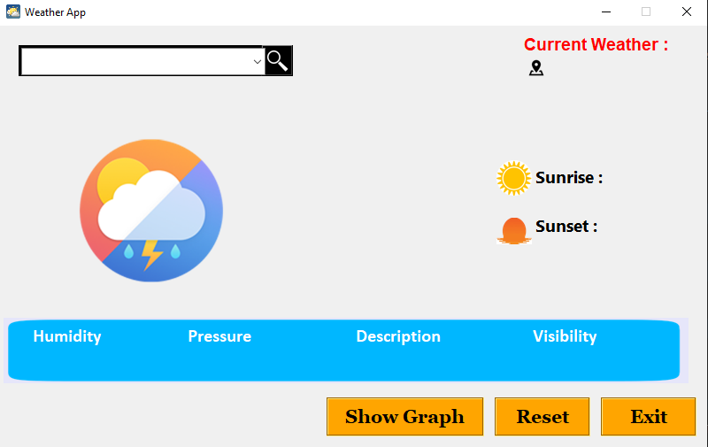
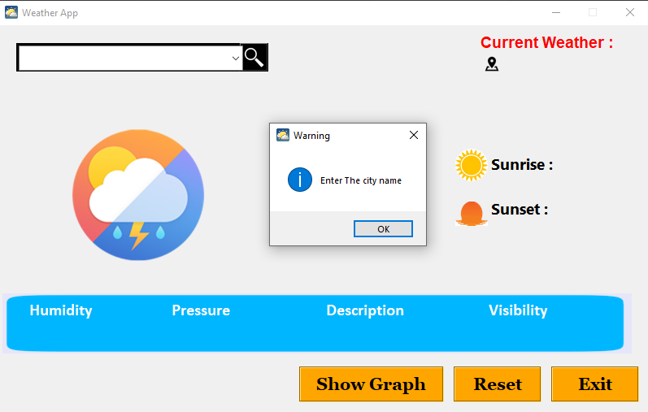
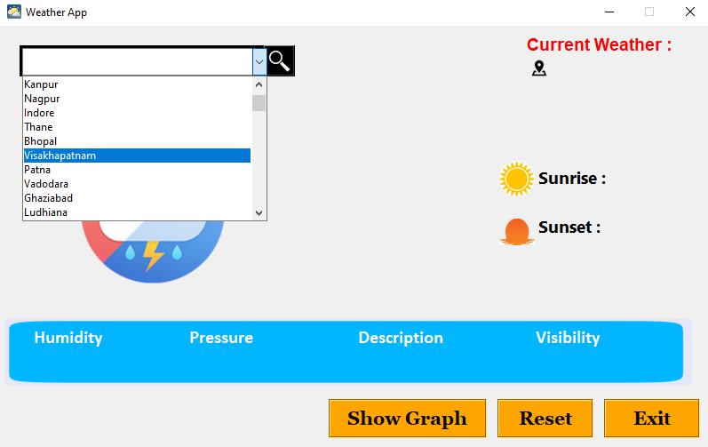
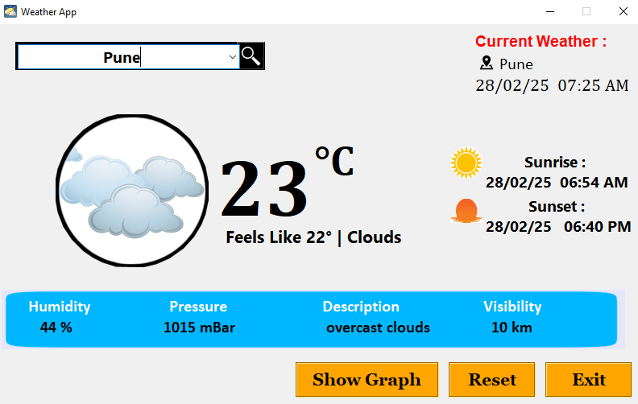
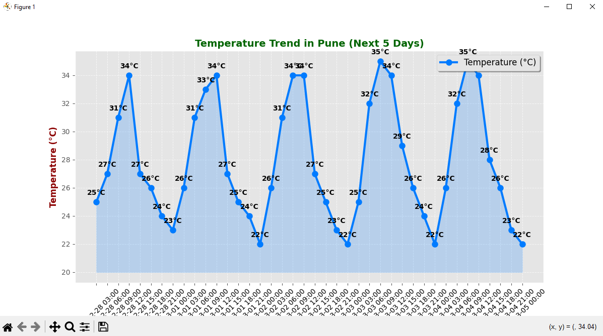
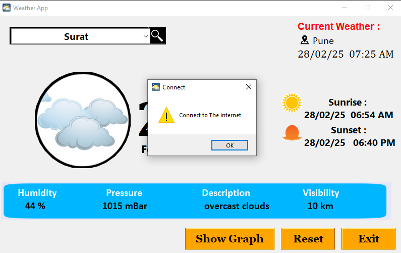

# 🌦️ Weather App Using Python Tkinter

A **desktop weather application** built using **Python** and **Tkinter** that provides real-time weather updates, forecasts, and alerts.

## 📌 Features
✅ **Current Weather** – Get real-time temperature, humidity, and weather conditions  
✅ **5-Day Forecast** – View upcoming weather predictions   
✅ **Location-Based Detection** – Automatically fetch weather data for your current location  
✅ **Search by City** – Look up weather for any city worldwide   
✅ **Sunrise & Sunset Times** – Know the exact timing for your location  
✅ **Historical Weather Data** – Analyze past weather trends  
✅ **Interactive UI** – Clean and user-friendly interface with Tkinter  

## 🛠️ Tech Stack
- **Python** – Core programming language  
- **Tkinter** – GUI framework for the application  
- **OpenWeatherMap API** – Fetch real-time weather data  
- **Requests** – Handle API calls  
- **PIL (Pillow)** – Display weather icons  
- **Matplotlib** – (Optional) Graphical representation of weather trends  

## 🚀 Installation & Setup
1️⃣ Clone the repository:
```sh
git clone https://github.com/pansarey91/Weather_App_Using_Python_Tkinter.git
cd Weather_App_Using_Python_Tkinter
```
2️⃣ Install dependencies:
```sh
pip install -r requirements.txt
```
3️⃣ Get an **API key** from [OpenWeatherMap](https://openweathermap.org/)  
4️⃣ Add the API key in the script (`config.py` or `.env` file)  
5️⃣ Run the app:
```sh
python app.py
```

## 🎨 Screenshots






